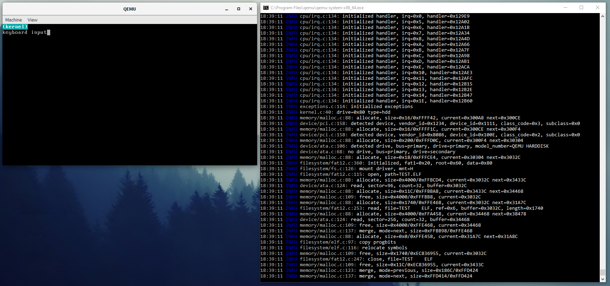

# What is this?

**Hjortron** is a tiny operating system for Intel Architecture, 32-bit. It is my way to explore the inner workings of a computer. And to learn more about low-level development.

It has a few minimal features; FAT12 (bootloader and filesystem), ATA driver, interrupt handler, keyboard driver, PCI enumeration, dynamic memory management, ELF relocation, serial port driver.

## Screenshot

Running in [QEMU](https://www.qemu.org/) with debug output in Windows (serial port).

## License

A conscious effort is made to provide the project with the MIT License. See [LICENSE](LICENSE).